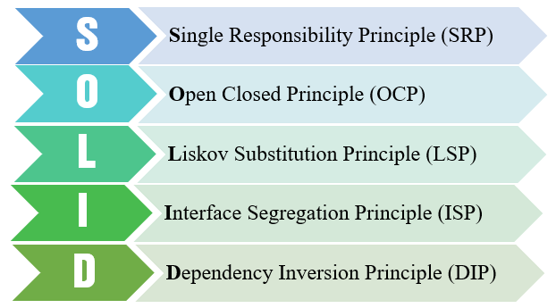

## API REST USING SOLID PRINCIPLES

This is an API REST built using Nodejs, Express and Typescript. It aims to show the implementation of SOLID principles in a backend project.

#### SOLID principles diagram

#### Articles

These articles can help you understand about the topic:

- <a href="https://www.digitalocean.com/community/conceptual_articles/s-o-l-i-d-the-first-five-principles-of-object-oriented-design#:~:text=SOLID%20is%20an%20acronym%20for,OOD)%20principles%20by%20Robert%20C.&text=O%20%2D%20Open%2Dclosed%20Principle,I%20%2D%20Interface%20Segregation%20Principle">Digital Ocean</a>
- <a href="https://medium.com/backticks-tildes/the-s-o-l-i-d-principles-in-pictures-b34ce2f1e898">The S.O.L.I.D Principles in Pictures </a>
- <a href="https://www.zup.com.br/blog/design-principle-solid"> ZUP Team (PT-BR) </a>
- <a href="https://medium.com/desenvolvendo-com-paixao/o-que-%C3%A9-solid-o-guia-completo-para-voc%C3%AA-entender-os-5-princ%C3%ADpios-da-poo-2b937b3fc530"> Medium article by João Roberto da Paixão (PT-BR) </a>

#### About the project

To open the project, execute `yarn run start:dev` or `npm run start:dev` commands.

#### Running tests

To run tests, execute `yarn test` or `npm test` commands.
